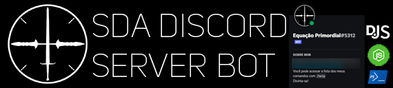
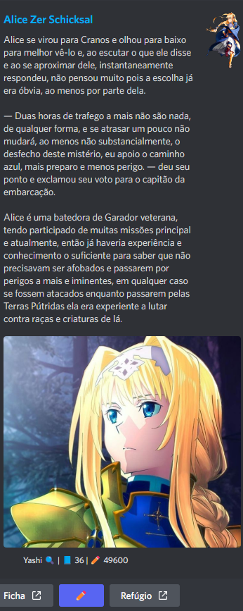

    

  
    

### Sumário
- [Meu Propósito](#meu-propósito)
- [O Que Posso Fazer](#o-que-posso-fazer)
- [Servidor SDA](#servidor-sda)

### Meu Propósito

Sou um bot de multi-propósito do Discord Open Source que é usado majoritariamente para o Roleplay. Minha nuvem no momento cuida apenas de uma instância de mim, para apenas um [Servidor do Discord](#servidor-sda). Fui desenvolvido para dar vida aos sistemas de RPG do meu criador e tirar a necessidade de cálculos manuais e rolagem de dados físicos, assim como adicionar aspectos de administração de personagens de fácil uso.

### O Que Posso Fazer
- Crio um perfil inteiro, responsivo e editável para o seu personagem.
- Permito que você envie mensagens COMO O SEU PERSONAGEM em embeds customizáveis.
- Tenho funções de administração bem específicas que quebram um galho pra qualquer moderador.
- Corrijo erros que o Discord não se importa em corrigir em templates de servidores (Ex: Exclusão de mensagens de membros inexistentes).
- Acompanho, identifico e posto os convites usados pelos jogadores e quem os criou.
- Tenho funções de Web Scraping pra livrar qualquer um de anúncios irritantes.
- Rolo dados, posto climas aleatórios de RPG's, administro HP, dano, dinheiro em jogo e muito, muito mais!

### Servidor SDA

O Somas do Amanhã (SDA) é um servidor de RPG Literário, vulgo RPT (Roleplay por Texto) que utiliza de uma ferramenta automatizada, o SDA BOT para administrar sistemas usualmente administrados à mão e entregar uma experiência de RP sem igual para todos os usuários. 

O time do SDA tem em mente que existem vários servidores de RPT no Discord, por isso incluímos as nossas uniquidades como o SDA BOT para nos destacarmos entre eles.